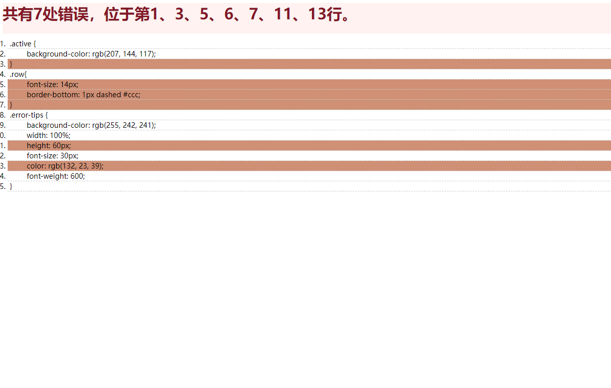

# code-highlight
## 代码高亮

## Project setup
```
npm install
```

### Compiles and hot-reloads for development
```
npm run serve
```
### 技术介绍
* 使用vue-cli搭建vue脚手架
* 使用mockjs模拟接口请求数据
* 使用原生HTML、CSS展示代码高亮
